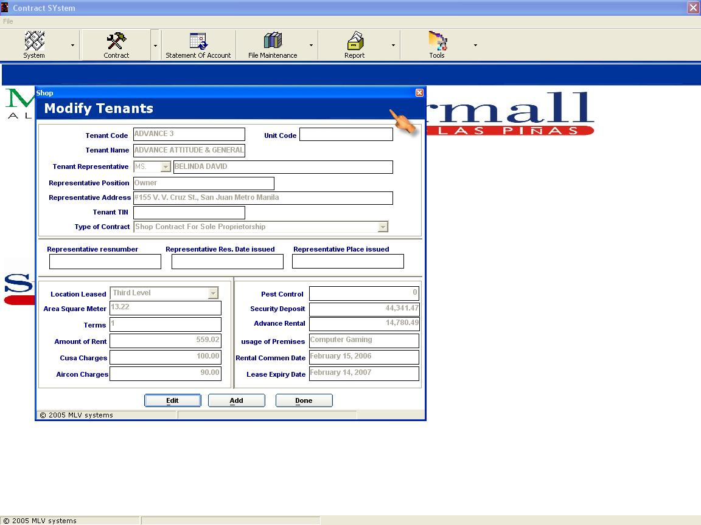



## Contract System

### Description

This is Contract system project which I made to my company. The program uses ADO and have lot of functionalities. If you download this program you will learn the fallowing:(1) Know how to use ADO in real world business software.(2) How to use unbound text in database programming. (3) How to use crystal report (4) How to how to design a good lessee contract .There is a lot more to learn from this code... so download it and share your comment on what you have learn. Please don't forget to vote! MABUHAY ANG PINOY -michael
 
### More Info
 

             |
---                |---
**Submitted On**   |2006-05-24 11:40:02
**By**             |[Michael L\. Velasco](https://github.com/Planet-Source-Code/PSCIndex/blob/master/ByAuthor/michael-l-velasco.md)
**Level**          |Advanced
**User Rating**    |4.8 (43 globes from 9 users)
**Compatibility**  |VB 5\.0, VB 6\.0
**Category**       |[Databases/ Data Access/ DAO/ ADO](https://github.com/Planet-Source-Code/PSCIndex/blob/master/ByCategory/databases-data-access-dao-ado__1-6.md)
**World**          |[Visual Basic](https://github.com/Planet-Source-Code/PSCIndex/blob/master/ByWorld/visual-basic.md)
**Archive File**   |[Contract\_S1996625242006\.zip](https://github.com/Planet-Source-Code/michael-l-velasco-contract-system__1-65464/archive/master.zip)

